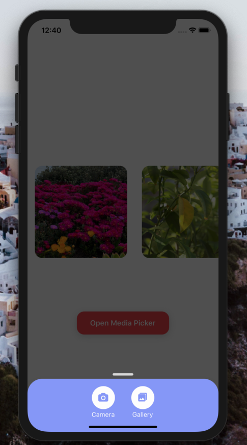

[](https://github.com/Paraboly/react-native-media-picker)

[](https://github.com/Paraboly/react-native-media-picker)

[](https://www.npmjs.com/package/@paraboly/react-native-media-picker)
[](https://www.npmjs.com/package/@paraboly/react-native-media-picker)

[](https://opensource.org/licenses/MIT)
[](https://github.com/prettier/prettier)

<p align="center">
  
  
</p>

# Installation

Add the dependency:

```ruby
npm i @paraboly/react-native-media-picker
```

## Peer Dependencies

###### IMPORTANT! You need install them

```js
"@freakycoder/react-native-helpers": ">= 0.1.2",
"react-native-image-crop-picker": ">= 0.26.2",
"react-native-modalize": ">= 2.0.0",
"react-native-vector-icons": ">= 6.6.0",
"react-native-dynamic-vector-icons": ">= 0.2.1",
```

## iOS & Android Permissions

### iOS

```plist
<key>NSCameraUsageDescription</key>
<string>This allows us to capture and use the the captured photo</string>
<key>NSPhotoLibraryAddUsageDescription</key>
<string>This allows us to show/pick a photo from your library</string>
<key>NSPhotoLibraryUsageDescription</key>
<string>This allows us to show/pick a photo from your library</string>
```

### Android

```xml
<uses-permission android:name="android.permission.CAMERA" />
<uses-permission android:name="android.permission.READ_EXTERNAL_STORAGE" />
```

# Usage

## Import

```js
import MediaPicker from "@paraboly/react-native-media-picker";
```

## Basic Usage

```jsx
<MediaPicker>
```

## Advanced Usage

You can check the example :) Put your own logic for galleryOnPress or cameraOnPress both returns the callback of the images.

```jsx
<MediaPicker
  multiple
  ref={(ref) => (this.mediaPicker = ref)}
  cameraOnPress={(image: any) => {
    this.setState({ image });
  }}
  galleryOnPress={(images: any) => {
    this.setState({
      image: null,
      images: images.map((image: any) => {
        return {
          uri: image.path,
          width: image.width,
          height: image.height,
          mime: image.mime,
        };
      }),
    });
    // ? Single Image (Multiple = false)
    // this.setState({
    //   image: {
    //     uri: image.path,
    //     width: image.width,
    //     height: image.height,
    //     mime: image.mime
    //   }
    // });
  }}
/>
```

## Open/Close The MediaPicker Modal

#### Open

```js
this.mediaPicker.openModal();
```

#### Close

```js
this.mediaPicker.closeModal();
```

# Configuration - Props

| Property                     |   Type    |   Default   | Description                                                                  |
| ---------------------------- | :-------: | :---------: | ---------------------------------------------------------------------------- |
| IconComponent                | component |    Icon     | set your own Icon component such as Icon from react-native-vector-icons      |
| multiple                     |  boolean  |    true     | change the picking media's as single or multiple at once                     |
| cameraText                   |  string   |   Camera    | change the camera button's text                                              |
| galleryText                  |  string   |   Gallery   | change the gallery button's text                                             |
| backgroundColor              |   color   |   #90a1fc   | change the modal's background color                                          |
| onCameraPress                | function  |   default   | set your own logic when camera is on pressed **(please check the example)**  |
| onGalleryPress               | function  |   default   | set your own logic when gallery is on pressed **(please check the example)** |
| cameraIconName               |  string   |   camera    | change the camera's icon name                                                |
| cameraIconType               |  string   | FontAwesome | change the camera's icon type                                                |
| cameraIconColor              |   color   |   #fdfdfd   | change the camera's icon color                                               |
| cameraIconSize               |  number   |     20      | change the camera's icon size                                                |
| galleryIconName              |  string   |  md-photos  | change the gallery's icon name                                               |
| galleryIconType              |  string   |  Ionicons   | change the gallery's icon type                                               |
| galleryIconColor             |   color   |   #fdfdfd   | change the gallery's icon color                                              |
| galleryIconSize              |  number   |     20      | change the gallery's icon size                                               |
| cameraButtonBackgroundColor  |   color   |   #fdfdfd   | change the camera button's background color                                  |
| galleryButtonBackgroundColor |   color   |   #fdfdfd   | change the gallery button's background color                                 |
| cameraButtonSize             |  number   |     50      | change the camera button's whole size                                        |
| galleryButtonSize            |  number   |     50      | change the gallery button's whole size                                       |
| cameraTextColor              |   color   |   #fdfdfd   | change the camera button's text color                                        |
| galleryTextColor             |   color   |   #fdfdfd   | change the gallery button's text color                                       |
| compressImageQuality         |  number   |     0.5     | change the quality of your photo                                             |

## Future Plans

- [x] ~~LICENSE~~
- [ ] Write an article about the lib on Medium

## Author

FreakyCoder, kurayogun@gmail.com

## License

React Native Media Picker by Paraboly is available under the MIT license. See the LICENSE file for more info.
